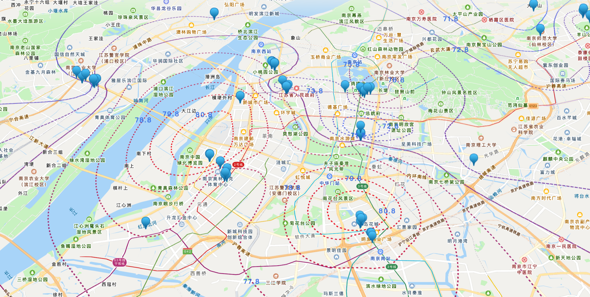
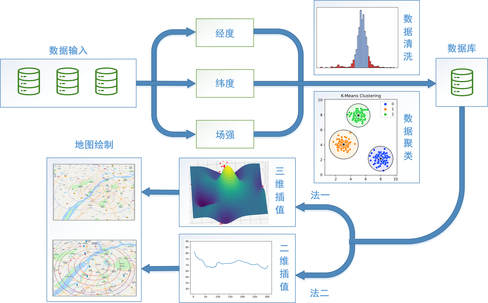

# Contour-visualization

### 项目简介：

本可视化系统可以用于显示地图界面，并根据输入测量数据标注出区域场强值，方便用户了解不同地点的场强分布情况，用户可以通过地图界面上的等值线，直观地了解每个位置的场强数值，从而对信号强度有一个清晰的认识。由于用于展示经纬度和对应场强值的数据不连续且可能存在噪声，该可视化系统使用了多种数据预处理方法，然后进行三维或插值和绘制等场强线，用户可以通过该可视化系统实现以下功能：数据导入、数据清理、数据聚合、平滑处理、数据插值、单点场强查询、滑动显示场强等功能，最终效果如下(图片或者gif显示不出来可能因为没开全局代理)：


将收集到的数据输入到可视化系统，由于收集到的数据具有一定的噪声，且在同一位置不同时间测量值会不断变化，系统提取出经纬度和场强大小之后将会做进一步的数据处理。

从数据的场强本身做数据清洗：通过绘制Quantile-Quantile Plot（Q-Q图），我们可以发现数据近似于正态分布，因此根据数据的分布，使用3σ\sigma原则，认为数据处于距离均值超过3个标准差的值为异常并进行剔除。

从数据的时间空间方向进行数据清洗：由于在收集数据时可能在同一个地点进行了多次采样，不同的天气和温差可能对波的传播造成一定的影响，某点的斗个场强值会在绘制过程中造成歧义，此外，若多个测量点距离相近且场强值差异过大，则会造成绘制曲线不平滑，因此我们可以采用Density-based spatial clustering of applications with noise（DBSCAN）、Meanshift、k-means等聚类方法，将时空上距离较近的点聚集在一起取平均存入数据库，便于下一步的处理。

在收集到清洗后的数据之后，我们可以利用Kriging插值方法进行三维插值，Kriging插值方法基于地理空间上的变量之间的空间相关性，通过利用已知数据点的空间分布来估计未知位置上的值，通过Kriging插值方法，我们可以利用已有的数据点的空间相关性来推断未知位置上的场强值。这种方法考虑了数据点之间的空间距离和变量之间的空间相关性，通过计算权重来估计未知位置上的值。这样，我们可以生成连续的三维插值地图，帮助我们理解和分析地理空间上的场强分布情况，将图中点绘制出后效果如下：



进一步观察三维插值后的具体模型，我们可以按照距离将其简化为二维插值模型，以降低模型复杂度并提高数据利用率。根据理论，从中心发射塔发射的场强会随着距离逐渐衰减，因此，在二维插值方法中，我们可以计算各个测量点与发射塔之间的距离，并应用滑动平均窗口使得曲线尽量平滑。然后，我们可以使用拉格朗日、线性或三次样条等方法，根据距离-场强的关系进行插值。

通过这样的二维插值方法，我们可以得到更简化的模型，对场强进行估计和插值，这样的分析有助于我们更好地理解发射塔周围的场强分布情况，并为相关决策提供更准确的数据支持。

可视化系统框架设计结构图如下：



### 使用方法：

运行`host.py`（如果遇见了`ModuleNotFoundError: No module named 'xxx'`, 则使用命令安装`pip install xxx`），在浏览器打开`http://localhost:5000/`，在框内输入需要显示的数据最小值、数据最大值、步长，然后点击“选择文件”，然后再点击上传按钮，拖动地图即可显示出图像，在这里你可以尝试使用`files/raw.xlsx`文件作为输入（主要是其他文件输入格式还需要改）。

### 其他：

修改`static/map.js`里面的`script.src`后面的key，换成自己的API（本项目不调用其他付费内容，不修改也可以正常使用），修改`center`的值可以初始化每次打开地图的中心（在项目中设置成了南京）。

修改`static/request.js`里面的参数，`throttleInterval`是限制调用频率的时间间隔，调小图像的刷新频率（帧率）会更高，修改参数`div`可以使得图像更加光滑（网格更密）。

对于输入的数据的格式，你可以修改`static/request.js`里面的updateFunction函数，主要是下面的部分（这部分是用于处理`files/raw.xlsx`文件的，主要是从第三列提取出经纬度坐标）：

```javascript

var Longitude_temp = [];
var Latitude_temp = [];
var Value_temp = [];

// 读取数据
for (let i = 2; i <= rowCount; i++) {
    let temp = sheets["C" + i].v;
    let regex = /[-+]?\d+(\.\d+)?/g; // 正则表达式匹配数字的模式
    let matches = temp.match(regex); // 匹配到的数字数组
    Longitude_temp.push(parseFloat(matches[0]));
    Latitude_temp.push(parseFloat(matches[1]));
    Value_temp.push(parseFloat(sheets["B" + i].v));
}
rowCount -= 1; // 首行是表头，不算在内

```
